# Decentralized Voting System with R307S Optical Fingerprint Sensor

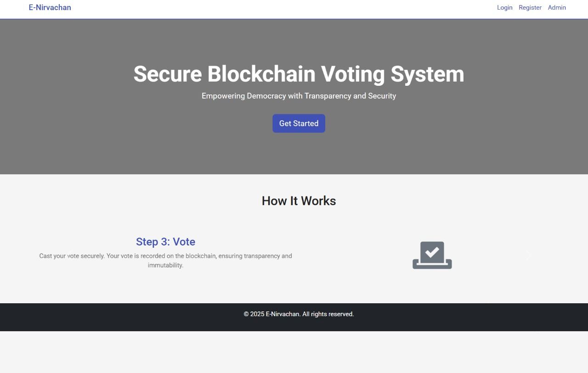

## Overview
This project is a decentralized voting system built with Flask, MongoDB, and Ethereum smart contracts. It leverages blockchain technology for secure, transparent voting and uses the R307S optical fingerprint sensor for biometric authentication of users.

---

## Features
- **User Registration & Login:** Citizens can register and log in using their Voter ID and password.
- **Biometric Authentication:** Uses the R307S optical fingerprint sensor to register and verify fingerprints for both voters and candidates.
- **Admin Dashboard:** Admins can manage elections, candidates, voters, and view system logs.
- **Candidate Management:** Add, edit, or remove candidates. Candidates can update their details and register fingerprints.
- **Voting:** Secure, one-person-one-vote system. Votes are recorded on the Ethereum blockchain.
- **Election Scheduling:** Admins can schedule, start, and stop elections.
- **Announcements:** Admins can post announcements visible to all users.
- **Activity Logs:** All critical actions are logged for transparency.

---

## Technology Stack
- **Backend:** Python (Flask)
- **Database:** MongoDB
- **Blockchain:** Ethereum (Ganache for local development, Web3.py for interaction)
- **Smart Contract:** Solidity (Voting.sol)
- **Biometric:** R307S Optical Fingerprint Sensor (via serial communication)
- **Frontend:** HTML, CSS, JavaScript (Jinja2 templates)

---

## Hardware Used
- **R307S Optical Fingerprint Sensor**
  - Used for capturing and verifying fingerprints during registration and voting.
  - Connected via serial port (COM7/COM4 or as configured).
  - Ensures only registered users can vote or be candidates.

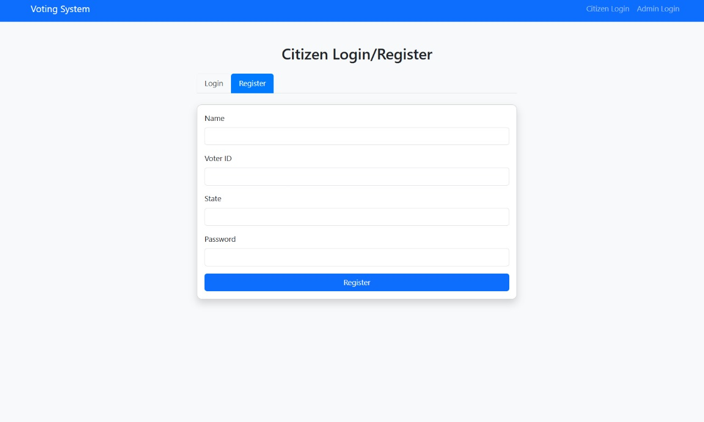
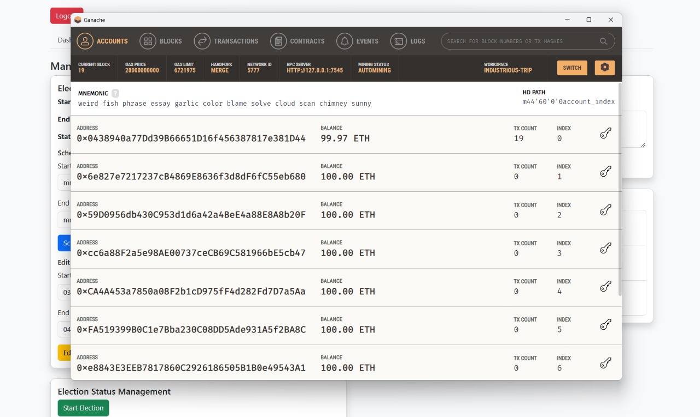

---

## Screenshots

### Admin Dashboard
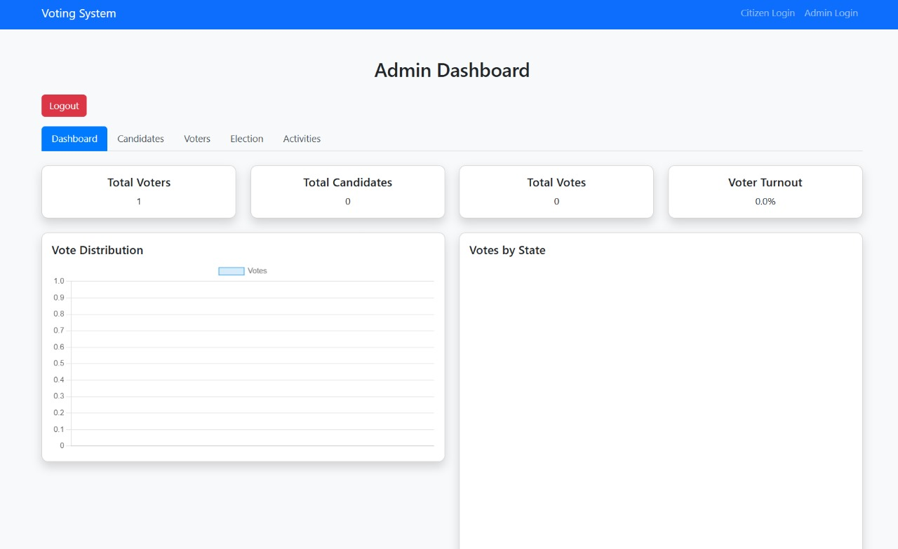

### Candidate Management
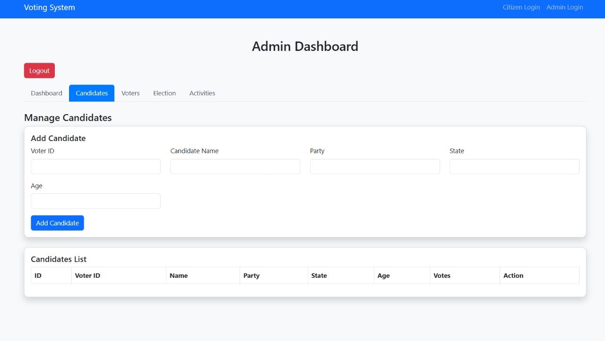

### Voter List
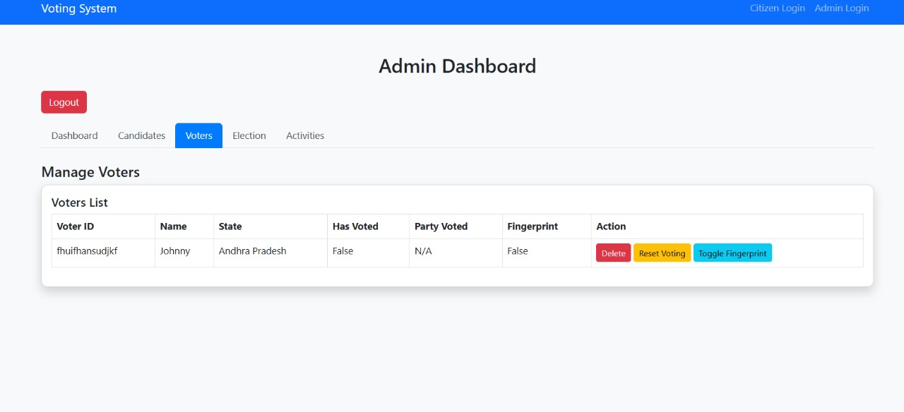

### Election Data (MongoDB)
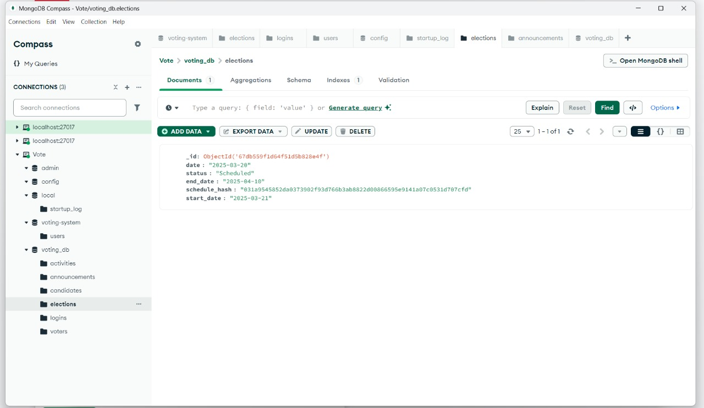

### Voters Database (MongoDB)
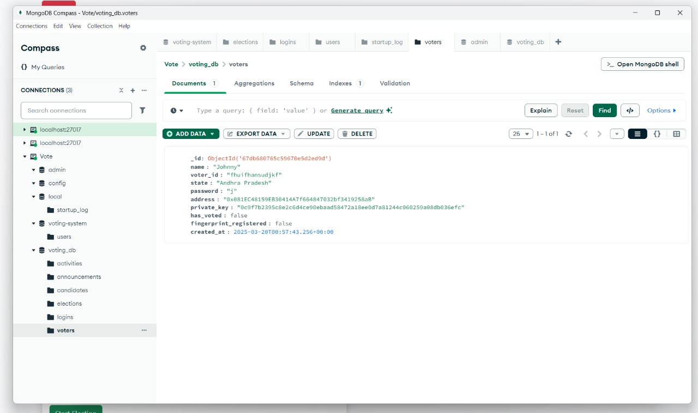

### Candidate Info (MongoDB)
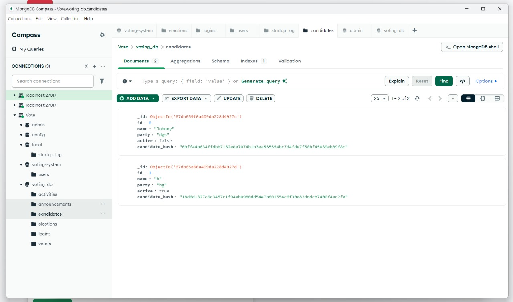

### Modify Elections
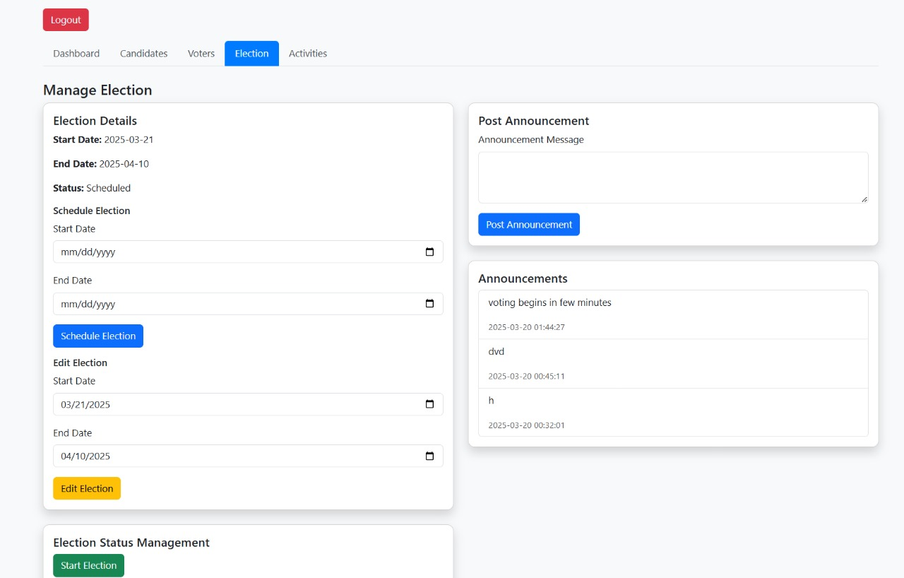

### Monitor Logs
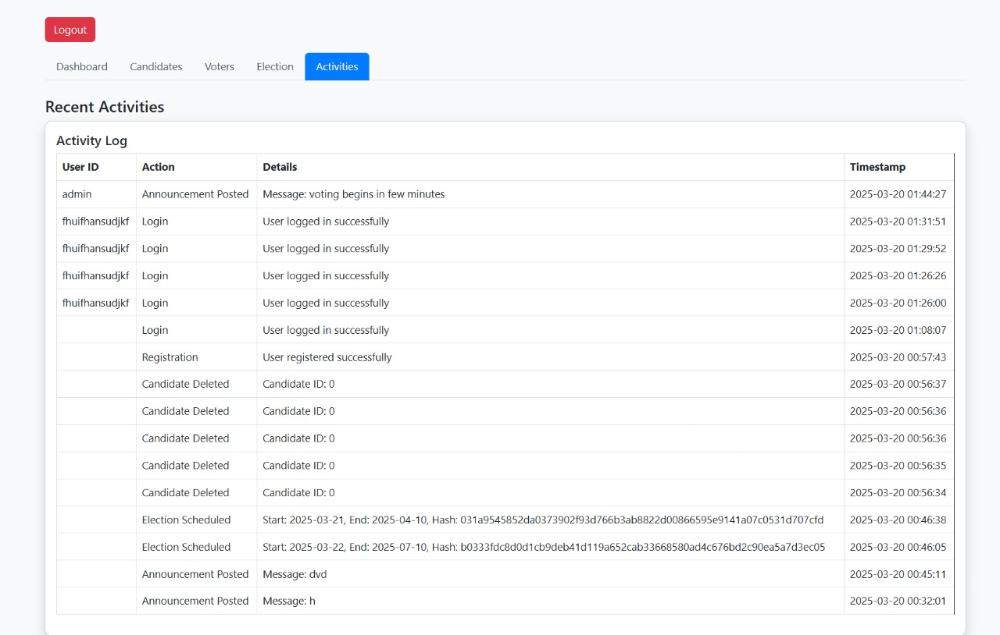

---

## How It Works
1. **Registration:**
   - Users register with Voter ID, password, and fingerprint.
   - Fingerprint is captured using the R307S sensor and stored securely.
2. **Login:**
   - Users log in with Voter ID and password.
   - Candidates have a separate dashboard.
3. **Admin Actions:**
   - Admin can add/edit/delete candidates, schedule elections, and post announcements.
4. **Voting:**
   - Only during an ongoing election, users can vote after fingerprint verification.
   - Vote is recorded on the blockchain and voter status is updated.
5. **Security:**
   - Passwords should be hashed in production.
   - Fingerprints are used for biometric authentication.
   - All actions are logged.

---

## Setup Instructions
1. **Clone the repository:**
   ```sh
   git clone https://github.com/deadhearth01/decentralized-voting-system-R307S.git
   cd decentralized-voting-system-R307S
   ```
2. **Install dependencies:**
   ```sh
   pip install -r requirements.txt
   ```
3. **Start MongoDB and Ganache:**
   - Make sure MongoDB is running on `localhost:27017`.
   - Start Ganache on `http://127.0.0.1:7545`.
4. **Deploy the smart contract:**
   - Use Truffle to deploy `Voting.sol` to Ganache.
5. **Connect the R307S fingerprint sensor:**
   - Plug into the configured serial port (default: COM7/COM4).
6. **Run the Flask app:**
   ```sh
   python app.py
   ```
7. **Access the app:**
   - Open your browser at `http://localhost:5000`

---

## Folder Structure
- `app.py` - Main Flask application
- `contracts/` - Solidity smart contract
- `build/` - Compiled contract artifacts
- `static/` - CSS, JS, images
- `templates/` - HTML templates
- `screenshots/` - Project screenshots

---

## Notes
- Change all default passwords and secret keys before deploying to production.
- For production, use HTTPS and secure your MongoDB instance.
- Passwords should be hashed and not stored in plaintext.

---

## License
This project is for educational purposes. Please check the repository for license details.
